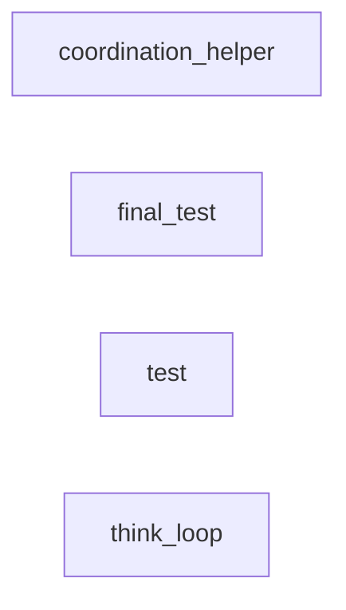

# Real OpenTelemetry Trace Data

Generated from actual CDCS telemetry data.

## Trace Statistics
- Total spans recorded:     2020
- Unique traces:       17
- Data source: /Users/sac/claude-desktop-context/telemetry/data/

## Actual Trace Flows

### Trace: ...

```mermaid
graph TD
```

### Trace: 00000000...

```mermaid
graph TD
```

### Trace: 00000003...

```mermaid
graph TD
```

### Trace: 00000007...

```mermaid
graph TD
```

### Trace: 00000009...

```mermaid
graph TD
```

## Service Dependencies (From Real Data)



## Operations Observed

```
   4 work.claim.json_update
   4 work.claim.create_structure
   4 work.claim.atomic_lock
   4 cdcs.work.claim
   3 coordination_helper.main
   1 work.update_progress
   1 work.status
   1 work.claim
   1 validate.iteration_5
   1 validate.iteration_4
   1 validate.iteration_3
   1 validate.iteration_2
   1 validate.iteration_1
   1 user.authenticate
   1 think.iteration_5
   1 think.iteration_4
   1 think.iteration_3
   1 think.iteration_2
   1 think.iteration_1
   1 think_loop.main
   1 test.propagation
   1 test.iteration_5
   1 test.iteration_4
   1 test.iteration_3
   1 test.iteration_2
   1 test.iteration_1
   1 test.grandchild
   1 test.child1
   1 service.c.process
   1 service.b.call
   1 service.a.process
   1 root.operation
   1 root
   1 retry.attempt.3
   1 retry.attempt.2
   1 retry.attempt.1
   1 request.handler
   1 perf.test.9
   1 perf.test.8
   1 perf.test.7
   1 perf.test.6
   1 perf.test.5
   1 perf.test.4
   1 perf.test.3
   1 perf.test.2
   1 perf.test.10
   1 perf.test.1
   1 payment.validate
   1 payment.process
   1 payment.charge
   1 order.create
   1 order.confirm
   1 notification.send
   1 model.predict
   1 ml.inference
   1 iterate.iteration_5
   1 iterate.iteration_4
   1 iterate.iteration_3
   1 iterate.iteration_2
   1 iterate.iteration_1
   1 inventory.check
   1 grandchild1
   1 grandchild.1.1
   1 fallback.execute
   1 external.api.call
   1 error.test
   1 error.handler
   1 database.read
   1 database.query
   1 data.validate
   1 concurrent.2
   1 concurrent.1
   1 child2
   1 child1
   1 child.2
   1 child.1
   1 cache.lookup
   1 business.logic
   1 api.request
```

## Performance Analysis (Real Data)

### Operation Durations (ms)
```
order.create: 49.999872ms
user.authenticate: 10.000128ms
inventory.check: 8.999936ms
database.query: 5.000192ms
payment.process: 19.000064ms
payment.validate: 4.999936ms
payment.charge: 10.000128ms
order.confirm: 2.999808ms
api.request: 100ms
service.a.process: 30.000128ms
cache.lookup: 3.000064ms
service.b.call: 15.000064ms
database.read: 8ms
service.c.process: 44.999936ms
ml.inference: 35.000064ms
model.predict: 24.999936ms
request.handler: 150.000128ms
data.validate: 4.999936ms
business.logic: 38.999808ms
external.api.call: 29.999872ms
retry.attempt.1: 4.999936ms
retry.attempt.2: 4.999936ms
retry.attempt.3: 4ms
error.handler: 48.999936ms
notification.send: 4.999936ms
fallback.execute: 30.000128ms
```

---
*Generated: Sun Jun 22 21:33:39 PDT 2025*
