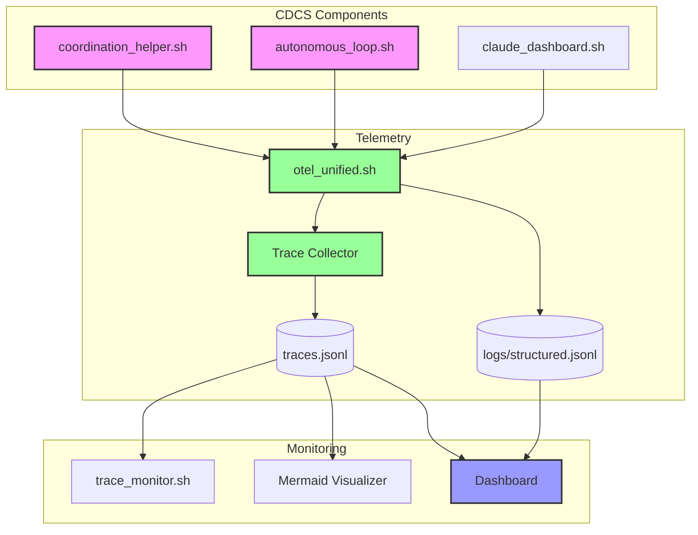
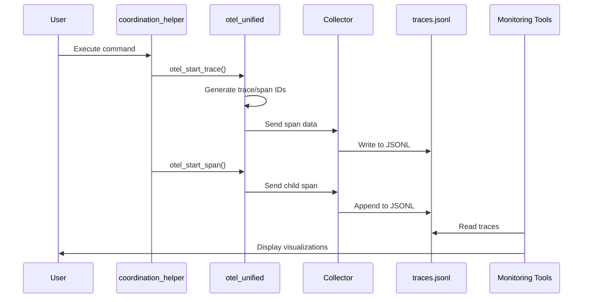

# CDCS OpenTelemetry Architecture

```mermaid
graph TB
    subgraph "CDCS Components"
        CH[coordination_helper.sh]
        AL[autonomous_loop.sh]
        CD[claude_dashboard.sh]
    end
    
    subgraph "Telemetry"
        OL[otel_unified.sh]
        TC[Trace Collector]
        TF[(traces.jsonl)]
        LF[(logs/structured.jsonl)]
    end
    
    subgraph "Monitoring"
        TM[trace_monitor.sh]
        VM[Mermaid Visualizer]
        DA[Dashboard]
    end
    
    CH --> OL
    AL --> OL
    CD --> OL
    
    OL --> TC
    TC --> TF
    OL --> LF
    
    TF --> TM
    TF --> VM
    TF --> DA
    LF --> DA
    
    style CH fill:#f9f,stroke:#333,stroke-width:2px
    style AL fill:#f9f,stroke:#333,stroke-width:2px
    style OL fill:#9f9,stroke:#333,stroke-width:2px
    style TC fill:#9f9,stroke:#333,stroke-width:2px
    style DA fill:#99f,stroke:#333,stroke-width:2px
```

## Data Flow

```mermaid
sequenceDiagram
    participant User
    participant CoordHelper as coordination_helper
    participant OTel as otel_unified
    participant Collector
    participant Storage as traces.jsonl
    participant Monitor as Monitoring Tools
    
    User->>CoordHelper: Execute command
    CoordHelper->>OTel: otel_start_trace()
    OTel->>OTel: Generate trace/span IDs
    OTel->>Collector: Send span data
    Collector->>Storage: Write to JSONL
    
    CoordHelper->>OTel: otel_start_span()
    OTel->>Collector: Send child span
    Collector->>Storage: Append to JSONL
    
    Monitor->>Storage: Read traces
    Monitor->>User: Display visualizations
```
