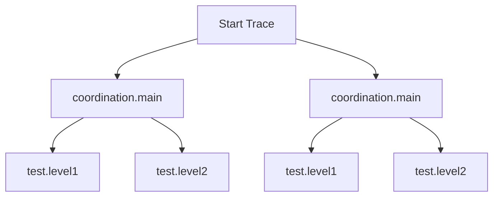

# Trace Flow Diagram

Generated from trace: b0221d62...

```mermaid
graph TD
    Start[Start Trace]
    Start --> 3a473a49["coordination.main"]
    3a473a49 --> 27259c85["test.level1"]
    3a473a49 --> f1ddefa2["test.level2"]
    Start --> A[coordination.main]
    A --> B[test.level1]
    A --> C[test.level2]
```
