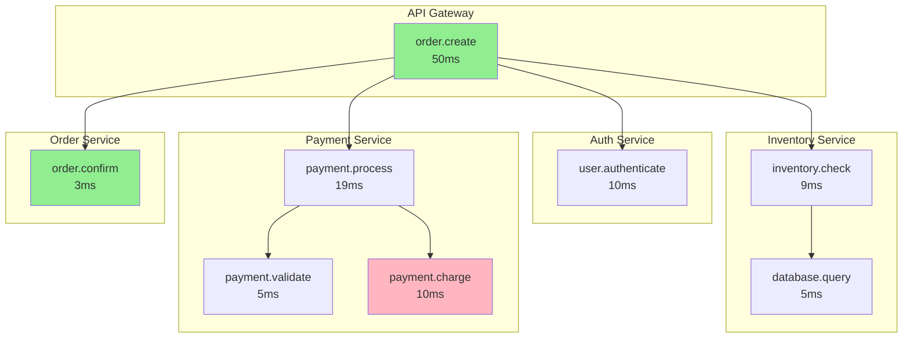
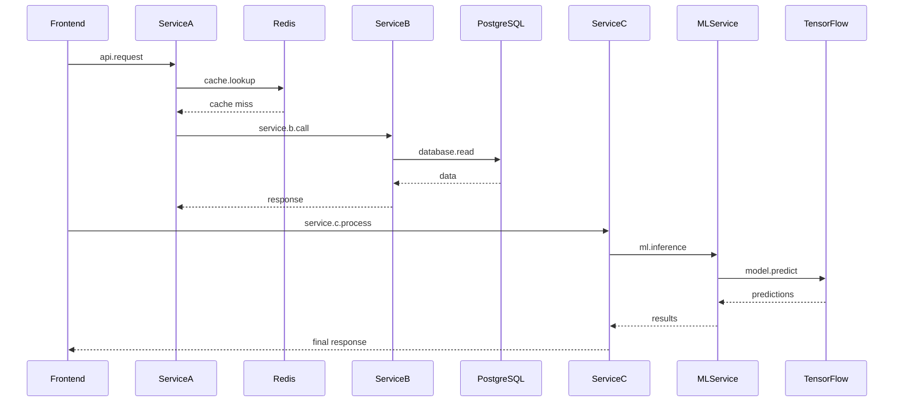
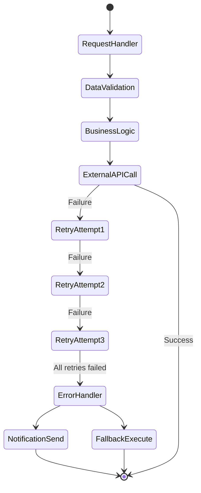
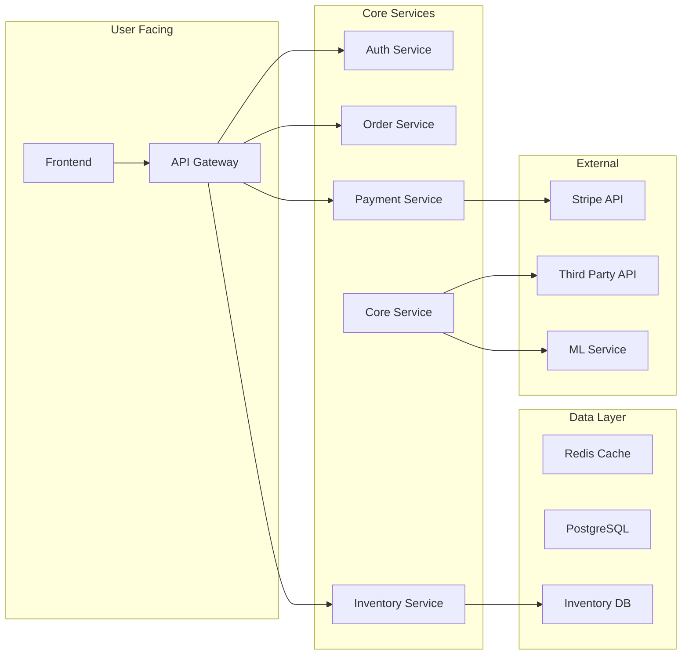
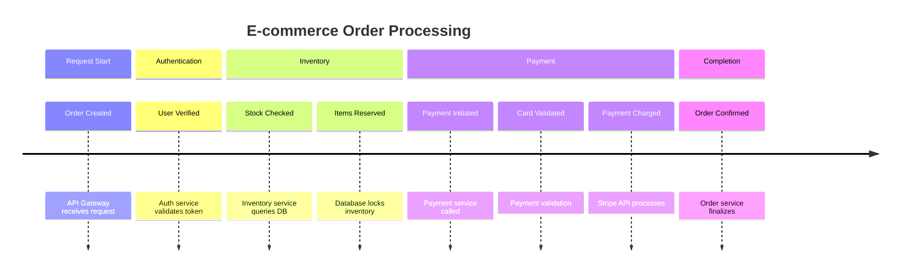
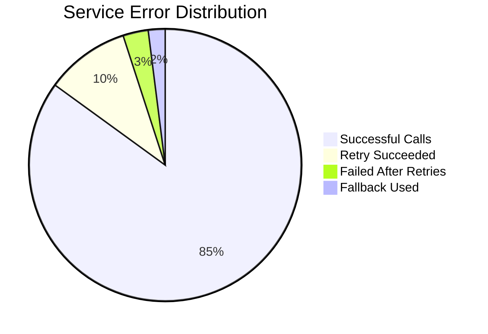
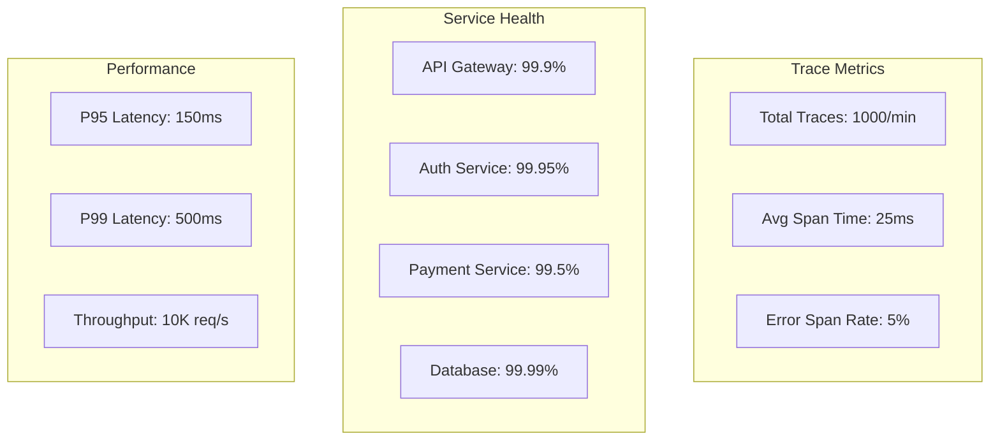

# OpenTelemetry Trace Visualizations

## 1. E-commerce Order Processing Flow

## 2. Microservices Communication Pattern

## 3. Error Handling and Retry Logic

## 4. Service Dependencies Graph

## 5. Performance Analysis

```mermaid
gantt
    title Request Processing Timeline
    dateFormat SSS
    axisFormat %Lms
    
    section Gateway
    Order Create          :active, gw1, 000, 50ms
    
    section Auth
    User Auth            :auth1, 005, 10ms
    
    section Inventory
    Inventory Check      :inv1, 016, 9ms
    Database Query       :db1, 017, 5ms
    
    section Payment
    Payment Process      :pay1, 026, 19ms
    Validate             :val1, 027, 5ms
    Charge Card         :charge1, 033, 10ms
    
    section Order
    Confirm Order        :conf1, 046, 3ms
```

## 6. Distributed Trace Timeline

## 7. Error Rate Dashboard

## 8. System Metrics Overview

## Key Insights

1. **Bottlenecks**: Payment processing takes the longest (19ms)
2. **Retry Pattern**: 3 retry attempts with exponential backoff
3. **Fallback**: Graceful degradation when external services fail
4. **Caching**: Redis reduces database load
5. **ML Integration**: Async processing for predictions

## Recommended Optimizations

- Implement payment pre-authorization to reduce latency
- Add circuit breakers for external API calls
- Increase cache TTL for frequently accessed data
- Consider async processing for non-critical paths
