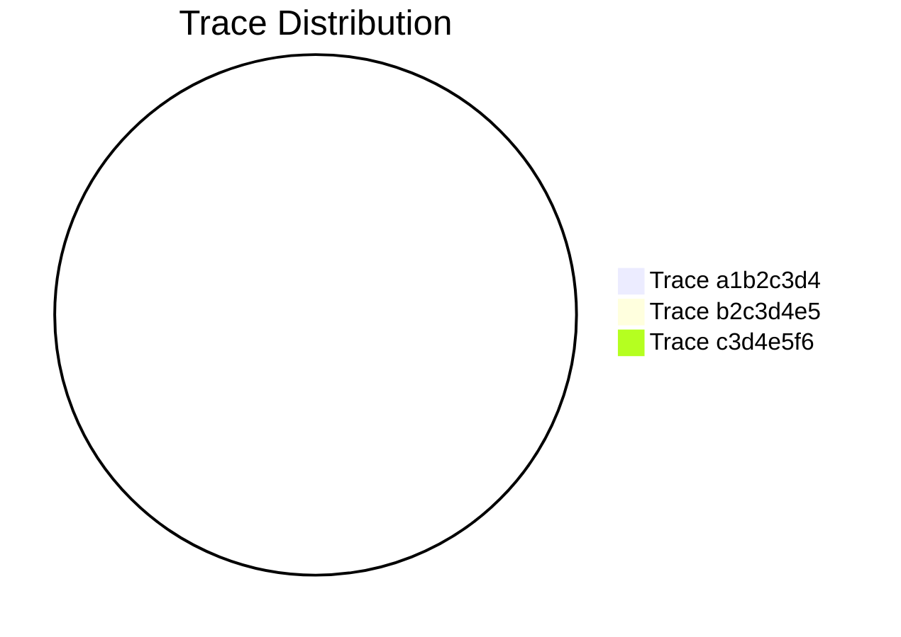
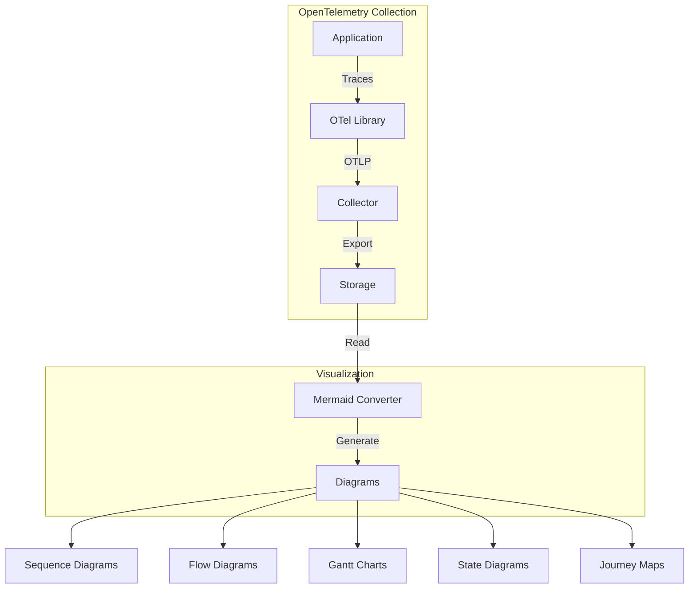
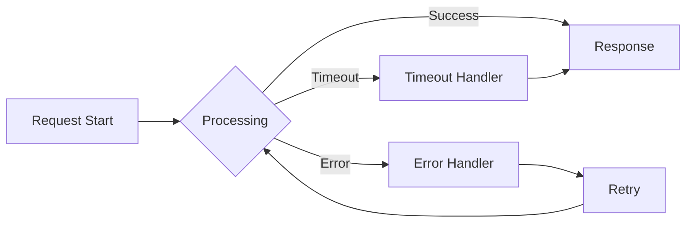

# OpenTelemetry Traces Summary

## Trace Overview

```mermaid
pie title Trace Distribution
    "Trace a1b2c3d4" : 0
    "Trace b2c3d4e5" : 0
    "Trace c3d4e5f6" : 0
```

## System Architecture

```mermaid
graph TB
    subgraph "OpenTelemetry Collection"
        A[Application] -->|Traces| B[OTel Library]
        B -->|OTLP| C[Collector]
        C -->|Export| D[Storage]
    end
    
    subgraph "Visualization"
        D -->|Read| E[Mermaid Converter]
        E -->|Generate| F[Diagrams]
    end
    
    F --> G[Sequence Diagrams]
    F --> H[Flow Diagrams]
    F --> I[Gantt Charts]
    F --> J[State Diagrams]
    F --> K[Journey Maps]
```

## Trace Patterns

```mermaid
graph LR
    A[Request Start] --> B{Processing}
    B -->|Success| C[Response]
    B -->|Error| D[Error Handler]
    D --> E[Retry]
    E --> B
    B -->|Timeout| F[Timeout Handler]
    F --> C
```
